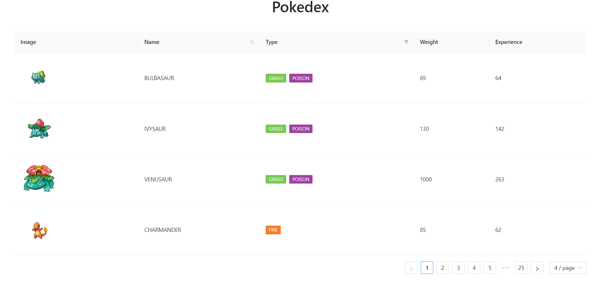
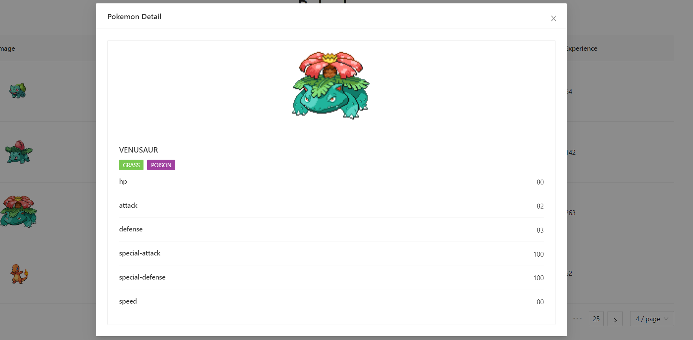

# PokeDex
  This is the Powerful Pokemon Application for getting more knowledge about pokemon and also you can add comments to your favourite pokemon.

## ScreenShots

Additional description about the project and its features.

## Live Demo
[live-demo](https://hector096.github.io/PokeApp/dist)

## Built With

- React
- Mobx
- Bootstrap
- webpack
- jest
- PokeApi
- Github

### Prerequisites

You have a basic understanding of HTML, CSS, JavaScript, Bootstrap, React, MobX, Jest, Git and Github.

## Getting Started

To get a local copy of this project just do the following:

- Clone the repository using `https://github.com/Hector096/Pokedex.git`
- Browse into the project's directory using `cd FlipCart`
- Install all the dependencies using `npm install`
- Start the server using `npm start`

## Testing

- Open the terminal
- On Windows => `Win + R`
- On Linux => `ctrl + alt + T`
- On Mac => `Control + Option + Shift + T`
- Run `npm run test`

## Authors
:bearded_person: **Hector**
  - GitHub: [@githubhandle](https://github.com/Hector096)
  - Linkedin: [@linkedinhandle](https://www.linkedin.com/in/vishal-verma-9191b8126/)

## 🤝 Contributing

Contributions, issues, and feature requests are welcome!

Feel free to check the [issues page](https://github.com/Hector096/Pokedex/issues).

## Show your support

Give a ⭐️ if you like this project!

## Acknowledgments

- Hat tip to anyone whose code was used
- Inspiration
- etc